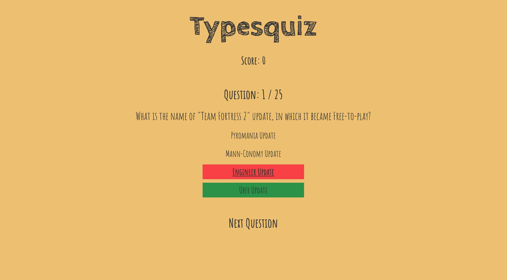
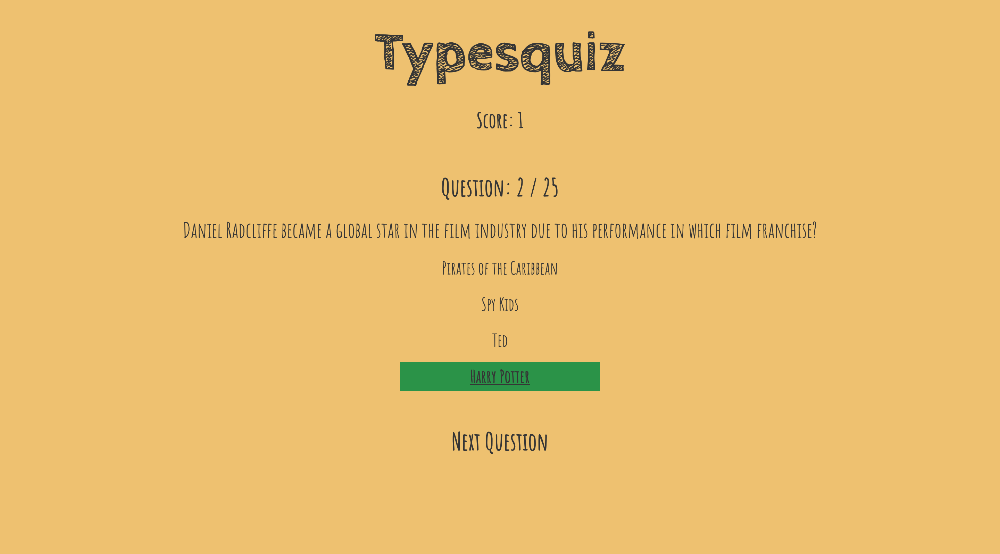

# about

Simple Trivia Quiz built with Typescript, React and Styled Components.





# technologies

- React
- Typescript
- Styled Components

# instructions

1.  clone repository

    ```bash
    git clone https://github.com/ingriddorioschulze/typesquiz
    cd typesquiz
    ```

2.  install dependencies

    ```bash
    npm install
    ```

3.  start the application

    ```bash
    npm start
    ```
